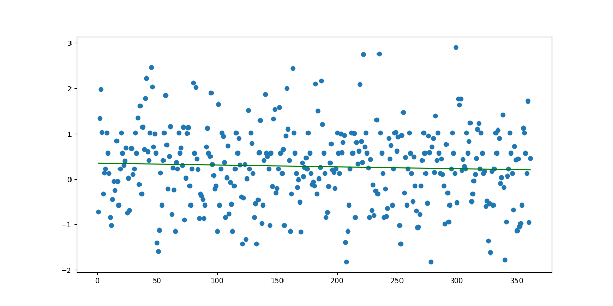
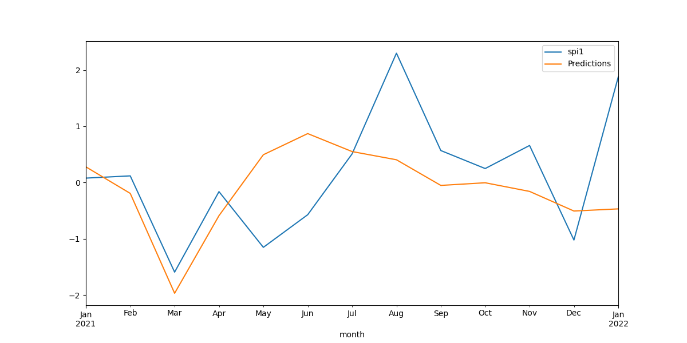
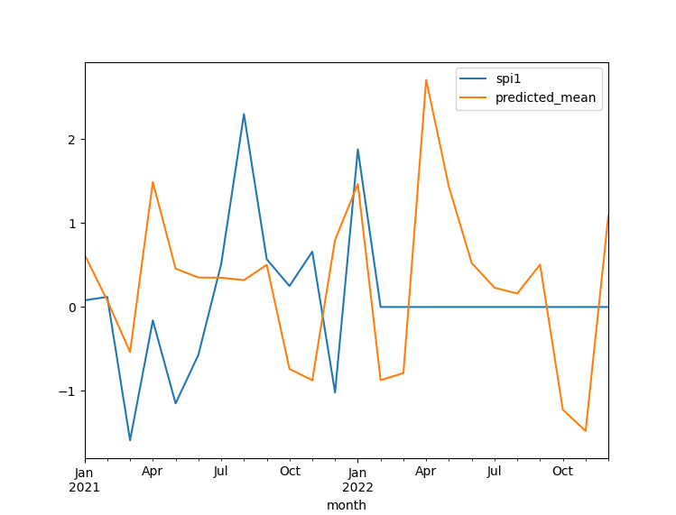

# CS4200-Drought-Prediction-AI

- Utilized 3 different regression models for predicting future droughts
- Scraped monthly rainfall data for Los Angeles from historical weather database
- Converted the data to Standard Precipitation Index(SPI) to utilizing scale for drought

# Three different models test
-Linear Regression Model

-Long Short-Term Memory Model (LSTM)

-Seasonal Auto-Regressive Integrated Moving Average with eXogenous factors (SARIMAX)

